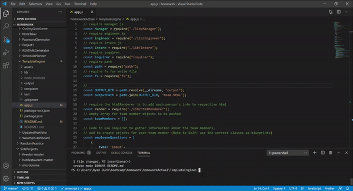

# Team Engine Template Generator

Built with HTML, javaScript, node, and Inquirer

URL of the GitHub repository: https://github.com/rpdurk/TemplateEngine

## Table of Contents 

* [Description](#description)
* [View](#view)
* [Usage](#usage)
* [Built With](#built-with)
* [Credits](#credits)
* [License](#license)

## Description

>Teams of all kinds want to showcase their valuable employees and give them credit for their hard work.  This Template Engine will allow an individual to use the command line to generate a template that describes fundamental information for their team members: mangers, engineers, and interns.

Utilize the [Inquirer npm package](https://github.com/SBoudrias/Inquirer.js/) to populate data for teams of any size. 

## View

The repository can be found, [here](https://github.com/rpdurk/TemplateEngine).

## Usage and Key Features

To use this application, download and run npm install.

* 

## Built With

* [HTML](https://html.spec.whatwg.org/) - Markup language used to define the structure of webpage.
* [Sematinc UI](https://semantic-ui.com/) - Development framework that helps create responsive layouts using human-friendly HTML.
* [javaScript](https://www.javascript.com/) - JavaScript language of the web.
* [jest](https://jestjs.io/) for running and validating the provided tests.
* [inquirer](https://www.npmjs.com/package/inquirer) . 

## License 

MIT License Copyright (c) 2020  Ryan Durk